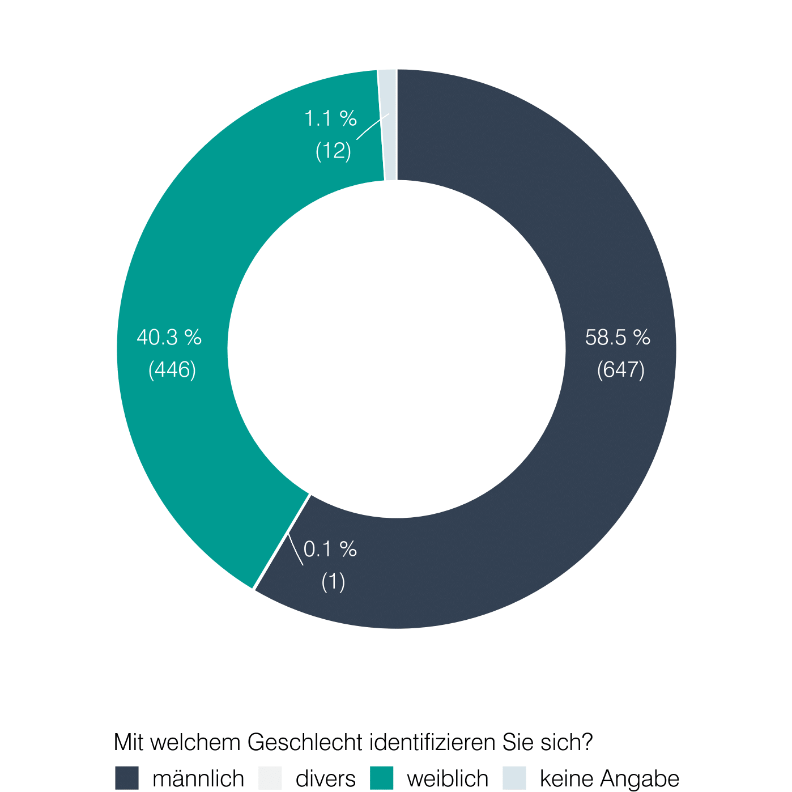
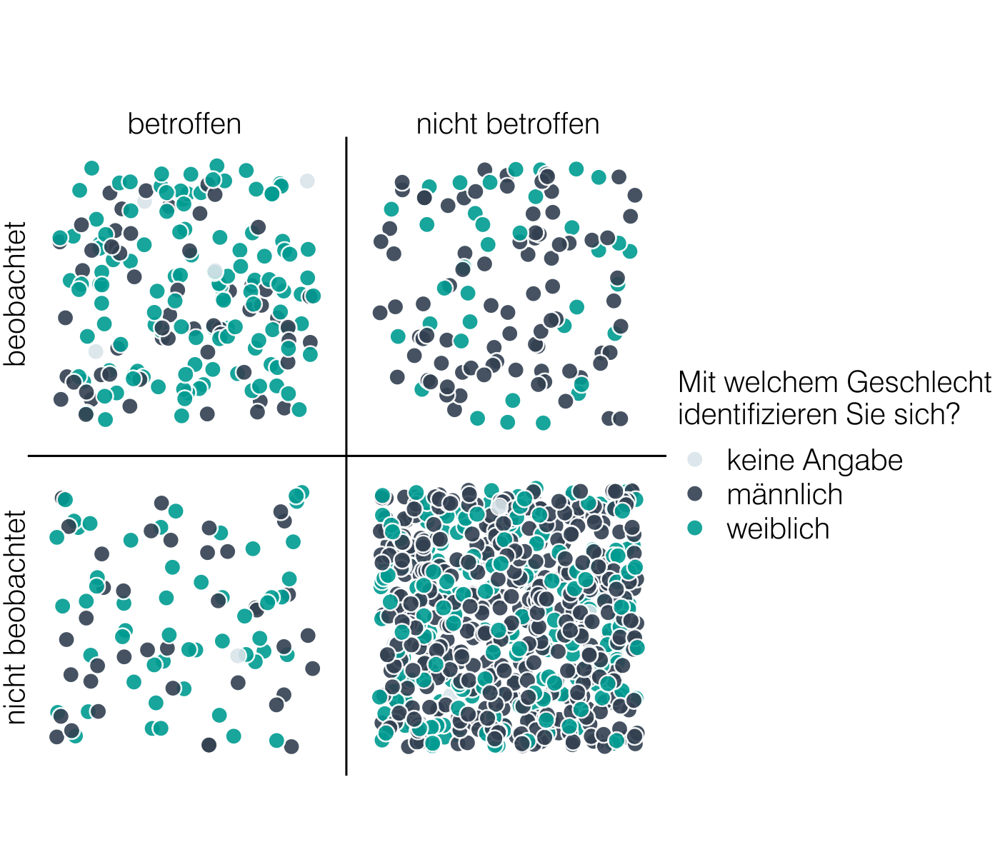

# Visualization of survey data on sexual harassment at a German university

This folder contains the final code for the visualization of a sexual harassment survey, conducted by a German university and analysed by me as a freelance data scientist in Fall 2023.

Note: This analysis is based on sensitive information, therefore the public version of the repository does not contain any data. Below you will nevertheless find instruction on the steps that would be necessary to repeat the analysis. 

## Examples

  
  

## Folder structure

 ├── **code** &#x1F4C1;   *contains all scripts*
 
│ &nbsp; &nbsp; &nbsp; &nbsp; └── fonts &#x1F4C1; *custom fonts*	

├── **data** &#x1F4C1; *contains data at various processing steps*
 
│ &nbsp; &nbsp; &nbsp; &nbsp;  └── raw &#x1F4C1;

│ &nbsp; &nbsp; &nbsp; &nbsp; └── processed &#x1F4C1;

│ &nbsp; &nbsp; &nbsp; &nbsp;  └── interim &#x1F4C1;

│ &nbsp; &nbsp; &nbsp; &nbsp; └── final &#x1F4C1;

├── **reports** &#x1F4C1; *documentation of data e.g. original surveys, semester reports, ...*

│ &nbsp; &nbsp; &nbsp; &nbsp; └── figures &#x1F4C1; *contains all final plots*

├── dockerfile &#x1F4C4;
 
├──  makefile  &#x1F4C4;

## Steps to recreate figures
This analysis is wrapped in a docker image and a makefile to ensure it stays reproducible.

1. Docker image was generated using `sudo docker build --build-arg WHEN=2023-10-09 -t analysis_harassment_2023 .` It is not recommended to regenerate unless something was changed in the code. Especially if new packages were installed, this would be necessary. Beware that this will install all packages from scratch, so this will take a while. If new packages need to be installed, this should be done via the Dockerfile found in this folder.
2. Run the Docker container. `sudo docker run analysis_harassment_2023`. If everything works fine, this should open a terminal from which to start the make file
3. Run `make all` to regenerate all plots and final data needed to create the plots. If only a specific plot <X> is needed, run `make P<X>`. A plot `P<X>` is usually created from  script called `P<X>.R` found in the code folder. See makefile for the structure.

This setup is loosely based on this tutorial: https://colinfay.me/docker-r-reproducibility/

